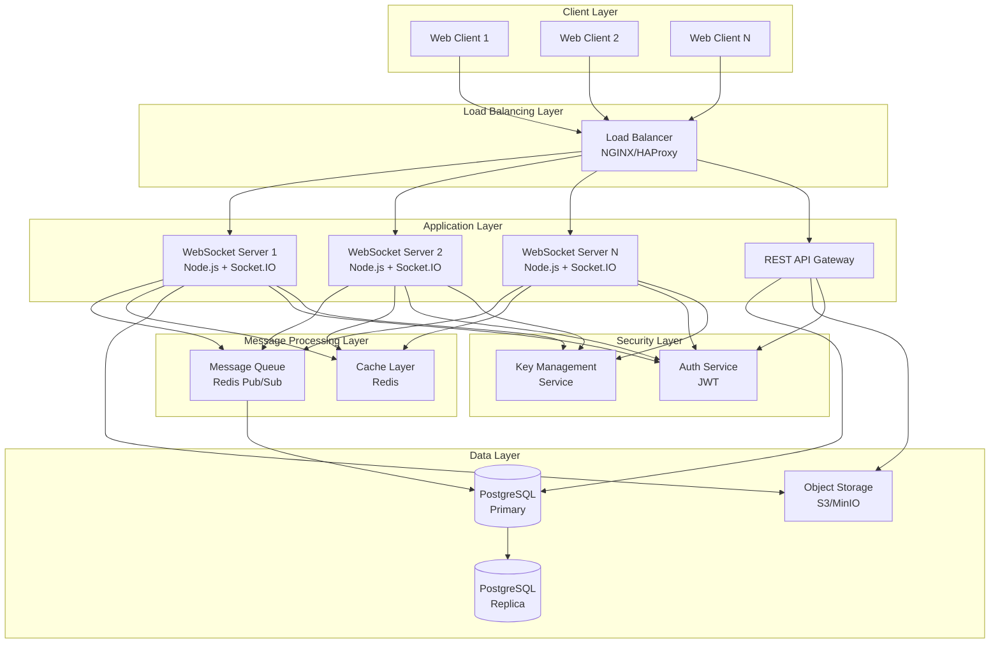
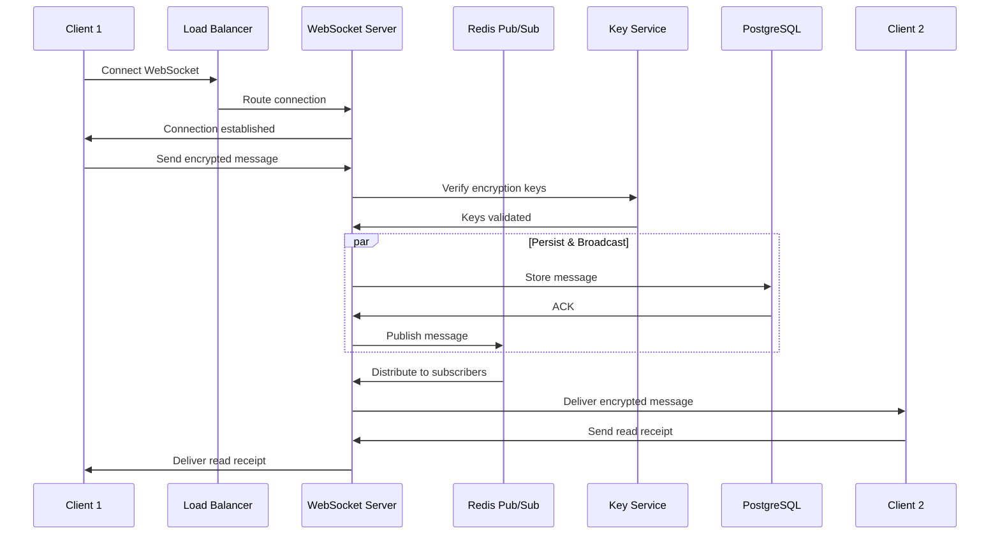
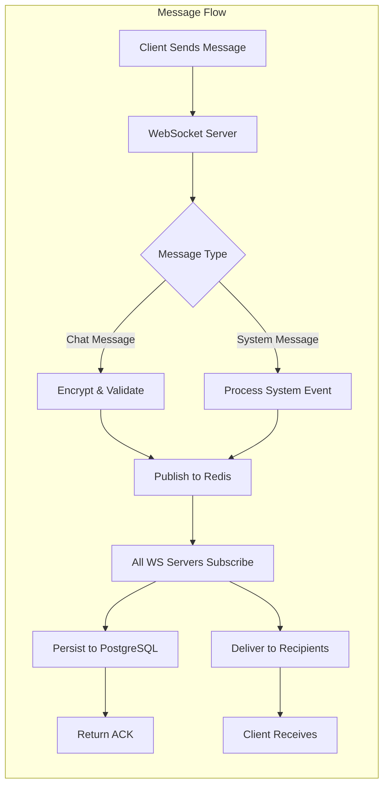
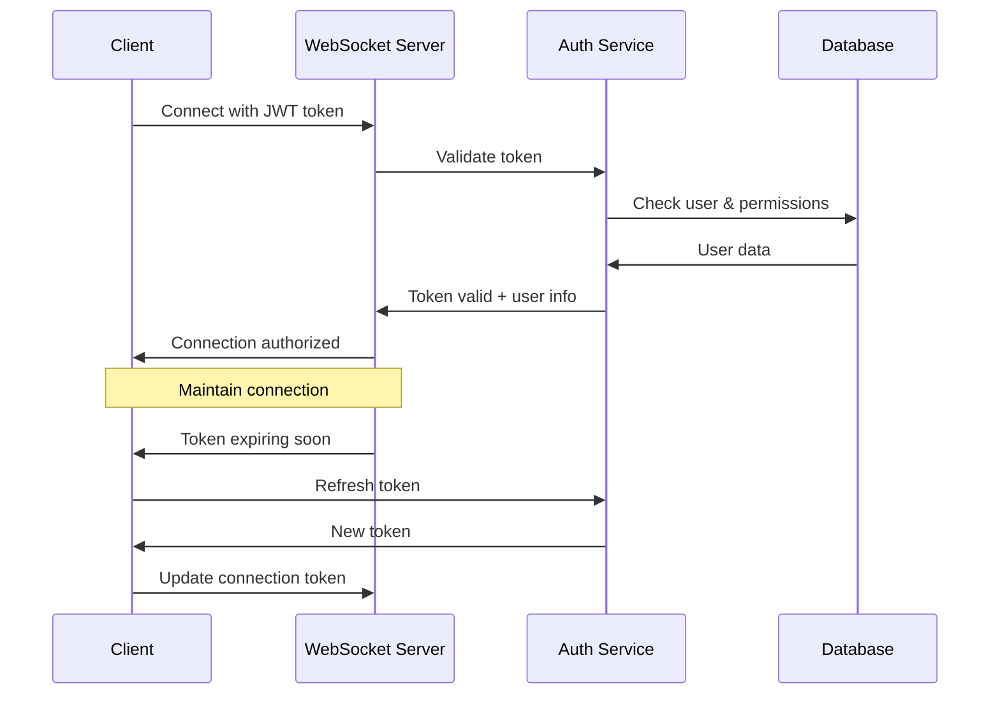
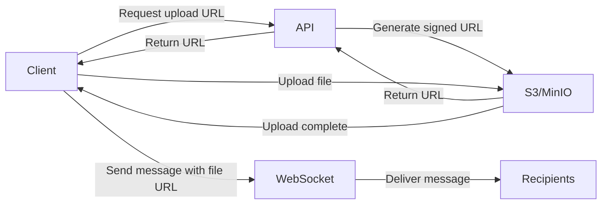
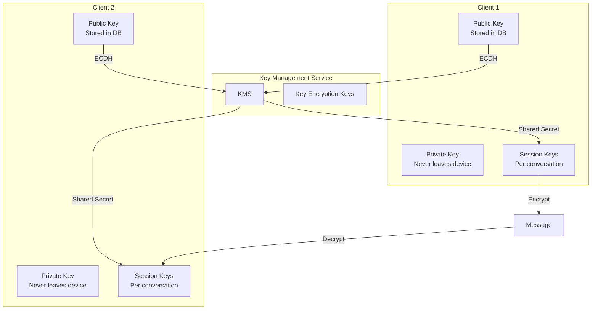
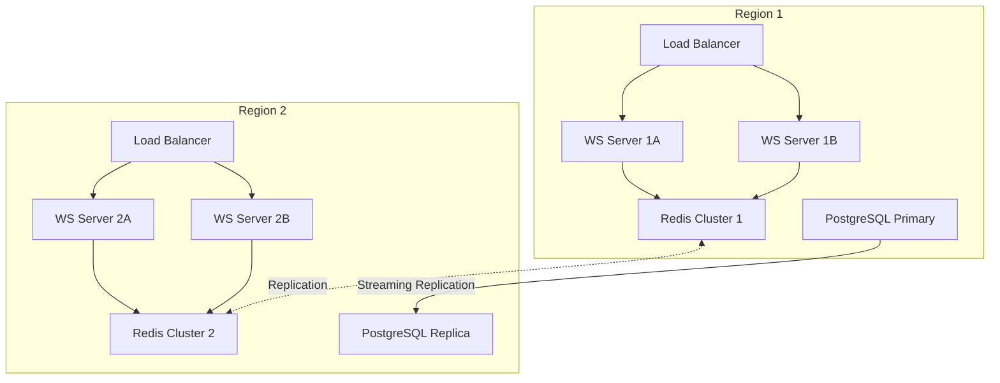
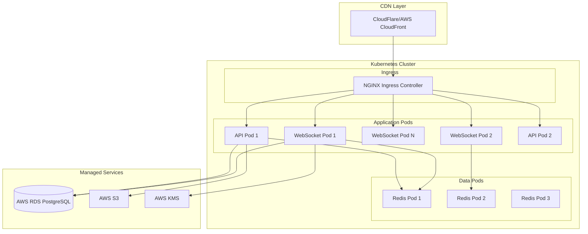

# Technical Design Document: Real-Time Chat Feature

**Version:** 1.0  
**Date:** December 5, 2025  
**Author:** Technical Design Team  
**Status:** Draft

---

## Table of Contents

1. [Executive Summary](#executive-summary)
2. [Problem Statement](#problem-statement)
3. [Requirements](#requirements)
4. [System Architecture](#system-architecture)
5. [Component Design](#component-design)
6. [Data Models](#data-models)
7. [API Design](#api-design)
8. [Security Architecture](#security-architecture)
9. [Performance & Scalability](#performance--scalability)
10. [Deployment Strategy](#deployment-strategy)
11. [Trade-offs & Alternatives](#trade-offs--alternatives)
12. [Success Metrics](#success-metrics)
13. [Implementation Roadmap](#implementation-roadmap)

---

## Executive Summary

This document outlines the technical design for implementing a real-time chat feature in the AJ Management Application. The solution leverages WebSocket technology for bidirectional communication, PostgreSQL for message persistence, end-to-end encryption for security, and is architected to support 10,000 concurrent users with horizontal scalability.

**Key Technologies:**
- WebSocket (Socket.IO/native WebSocket)
- PostgreSQL with optimized indexing
- Redis for pub/sub and caching
- AES-256-GCM for end-to-end encryption
- Node.js backend with clustering
- Load balancer (NGINX/HAProxy)

---

## Problem Statement

The AJ Management Application currently lacks real-time communication capabilities between employees. This limitation creates delays in collaboration, reduces team productivity, and forces users to rely on external communication tools.

**Current Challenges:**
- No instant messaging capability between employees
- Lack of message history and searchability
- No secure communication channel for sensitive discussions
- Inability to scale for growing user base

**Business Impact:**
- Reduced employee productivity due to communication delays
- Security risks from using unauthorized third-party chat applications
- Poor user experience and engagement
- Data fragmentation across multiple tools

---

## Requirements

### Functional Requirements

1. **Real-Time Messaging**
   - Instant message delivery (< 100ms latency)
   - Support for 1-on-1 and group chats
   - Message read receipts and typing indicators
   - File sharing capabilities (images, documents)
   - Message search and history

2. **Message Persistence**
   - All messages stored in PostgreSQL
   - Message history accessible for 2 years
   - Support for message editing and deletion
   - Offline message queue

3. **User Management**
   - User presence status (online/away/offline)
   - User blocking and reporting
   - Chat room creation and management
   - User permissions and roles

### Non-Functional Requirements

1. **Scalability**
   - Support 10,000 concurrent WebSocket connections
   - Handle 100,000 messages per second
   - Horizontal scaling capability
   - Database sharding support

2. **Security**
   - End-to-end encryption using AES-256-GCM
   - TLS/SSL for transport security
   - Authentication and authorization
   - Data encryption at rest
   - Compliance with GDPR and data protection regulations

3. **Performance**
   - Message delivery latency < 100ms (p95)
   - Message persistence latency < 50ms
   - WebSocket connection establishment < 500ms
   - 99.9% uptime SLA

4. **Availability**
   - Multi-region deployment
   - Automatic failover
   - Zero-downtime deployments
   - Data backup and disaster recovery

---

## System Architecture

### High-Level Architecture



### Data Flow Architecture



### Component Communication Flow



---

## Component Design

### 1. WebSocket Server Component

**Responsibilities:**
- Manage WebSocket connections
- Handle connection lifecycle (connect, disconnect, reconnect)
- Message routing and delivery
- Session management
- Rate limiting and throttling

**Technology Stack:**
- Node.js v18+ with clustering
- Socket.IO v4.x for WebSocket abstraction
- Express.js for HTTP endpoints
- PM2 for process management

**Key Features:**
```javascript
// WebSocket Server Configuration
{
  transports: ['websocket', 'polling'],
  pingTimeout: 30000,
  pingInterval: 25000,
  maxHttpBufferSize: 1e6, // 1MB
  cors: {
    origin: process.env.ALLOWED_ORIGINS,
    credentials: true
  },
  connectionStateRecovery: {
    maxDisconnectionDuration: 2 * 60 * 1000, // 2 minutes
    skipMiddlewares: true
  }
}
```

**Connection Management:**
- Sticky session support using Redis adapter
- Automatic reconnection with exponential backoff
- Connection health monitoring
- Graceful degradation to long-polling

### 2. Message Processing Component

**Responsibilities:**
- Message validation and sanitization
- Encryption/decryption handling
- Message queueing for offline users
- Duplicate message detection
- Message ordering guarantee

**Implementation:**
```javascript
class MessageProcessor {
  async processMessage(message) {
    // 1. Validate message structure
    await this.validate(message);
    
    // 2. Check encryption
    await this.verifyEncryption(message);
    
    // 3. Store in database
    const stored = await this.persist(message);
    
    // 4. Publish to subscribers
    await this.publish(message);
    
    // 5. Update cache
    await this.updateCache(message);
    
    return stored;
  }
}
```

### 3. Authentication & Authorization Component

**Responsibilities:**
- User authentication via JWT tokens
- WebSocket connection authorization
- Permission validation
- Session management
- Token refresh mechanism

**Flow:**


### 4. Presence Management Component

**Responsibilities:**
- Track user online/offline status
- Manage user availability states
- Broadcast presence updates
- Handle last-seen timestamps

**Data Structure:**
```javascript
// Redis presence storage
{
  "user:123:presence": {
    status: "online",
    lastSeen: "2025-12-05T10:13:00Z",
    socketId: "abc123",
    serverId: "ws-server-1"
  }
}
```

### 5. File Upload Component

**Responsibilities:**
- Handle file uploads (images, documents)
- Generate secure upload URLs
- Virus scanning
- Thumbnail generation for images
- Storage in S3-compatible object storage

**Upload Flow:**


### 6. Message Queue Component

**Responsibilities:**
- Queue messages for offline users
- Ensure message delivery ordering
- Handle message retry logic
- Dead letter queue for failed messages

**Technology:**
- Redis Pub/Sub for real-time distribution
- PostgreSQL for persistent queue
- Bull/BullMQ for job processing

---

## Data Models

### PostgreSQL Schema

```sql
-- Users table (simplified, assumes existing user management)
CREATE TABLE users (
    id BIGSERIAL PRIMARY KEY,
    username VARCHAR(255) UNIQUE NOT NULL,
    email VARCHAR(255) UNIQUE NOT NULL,
    public_key TEXT, -- For E2E encryption
    created_at TIMESTAMP DEFAULT CURRENT_TIMESTAMP,
    updated_at TIMESTAMP DEFAULT CURRENT_TIMESTAMP
);

-- Chat rooms/conversations
CREATE TABLE conversations (
    id BIGSERIAL PRIMARY KEY,
    type VARCHAR(50) NOT NULL, -- 'direct' or 'group'
    name VARCHAR(255), -- For group chats
    created_by BIGINT REFERENCES users(id),
    created_at TIMESTAMP DEFAULT CURRENT_TIMESTAMP,
    updated_at TIMESTAMP DEFAULT CURRENT_TIMESTAMP,
    metadata JSONB DEFAULT '{}'::jsonb
);

CREATE INDEX idx_conversations_type ON conversations(type);
CREATE INDEX idx_conversations_created_at ON conversations(created_at);

-- Conversation participants
CREATE TABLE conversation_participants (
    id BIGSERIAL PRIMARY KEY,
    conversation_id BIGINT REFERENCES conversations(id) ON DELETE CASCADE,
    user_id BIGINT REFERENCES users(id) ON DELETE CASCADE,
    role VARCHAR(50) DEFAULT 'member', -- 'admin', 'member'
    joined_at TIMESTAMP DEFAULT CURRENT_TIMESTAMP,
    last_read_at TIMESTAMP DEFAULT CURRENT_TIMESTAMP,
    notification_settings JSONB DEFAULT '{}'::jsonb,
    UNIQUE(conversation_id, user_id)
);

CREATE INDEX idx_conv_participants_user ON conversation_participants(user_id);
CREATE INDEX idx_conv_participants_conv ON conversation_participants(conversation_id);

-- Messages table (partitioned by date for scalability)
CREATE TABLE messages (
    id BIGSERIAL PRIMARY KEY,
    conversation_id BIGINT REFERENCES conversations(id) ON DELETE CASCADE,
    sender_id BIGINT REFERENCES users(id),
    content TEXT NOT NULL, -- Encrypted content
    message_type VARCHAR(50) DEFAULT 'text', -- 'text', 'file', 'image', 'system'
    encryption_metadata JSONB, -- IV, key info, algorithm
    attachments JSONB DEFAULT '[]'::jsonb,
    reply_to_id BIGINT REFERENCES messages(id),
    is_edited BOOLEAN DEFAULT FALSE,
    is_deleted BOOLEAN DEFAULT FALSE,
    created_at TIMESTAMP DEFAULT CURRENT_TIMESTAMP,
    updated_at TIMESTAMP DEFAULT CURRENT_TIMESTAMP
) PARTITION BY RANGE (created_at);

-- Create partitions for messages (quarterly partitions)
CREATE TABLE messages_2025_q4 PARTITION OF messages
    FOR VALUES FROM ('2025-10-01') TO ('2026-01-01');

CREATE TABLE messages_2026_q1 PARTITION OF messages
    FOR VALUES FROM ('2026-01-01') TO ('2026-04-01');

-- Indexes for messages
CREATE INDEX idx_messages_conversation ON messages(conversation_id, created_at DESC);
CREATE INDEX idx_messages_sender ON messages(sender_id);
CREATE INDEX idx_messages_created_at ON messages(created_at DESC);

-- Message delivery status
CREATE TABLE message_delivery_status (
    id BIGSERIAL PRIMARY KEY,
    message_id BIGINT REFERENCES messages(id) ON DELETE CASCADE,
    user_id BIGINT REFERENCES users(id) ON DELETE CASCADE,
    status VARCHAR(50) NOT NULL, -- 'sent', 'delivered', 'read'
    timestamp TIMESTAMP DEFAULT CURRENT_TIMESTAMP,
    UNIQUE(message_id, user_id)
);

CREATE INDEX idx_delivery_status_message ON message_delivery_status(message_id);
CREATE INDEX idx_delivery_status_user ON message_delivery_status(user_id, status);

-- User presence
CREATE TABLE user_presence (
    user_id BIGINT PRIMARY KEY REFERENCES users(id) ON DELETE CASCADE,
    status VARCHAR(50) NOT NULL, -- 'online', 'away', 'offline'
    last_seen TIMESTAMP DEFAULT CURRENT_TIMESTAMP,
    socket_id VARCHAR(255),
    server_id VARCHAR(255),
    updated_at TIMESTAMP DEFAULT CURRENT_TIMESTAMP
);

CREATE INDEX idx_presence_status ON user_presence(status);
CREATE INDEX idx_presence_last_seen ON user_presence(last_seen);

-- Blocked users
CREATE TABLE blocked_users (
    id BIGSERIAL PRIMARY KEY,
    blocker_id BIGINT REFERENCES users(id) ON DELETE CASCADE,
    blocked_id BIGINT REFERENCES users(id) ON DELETE CASCADE,
    created_at TIMESTAMP DEFAULT CURRENT_TIMESTAMP,
    UNIQUE(blocker_id, blocked_id)
);

CREATE INDEX idx_blocked_users_blocker ON blocked_users(blocker_id);

-- File attachments
CREATE TABLE file_attachments (
    id BIGSERIAL PRIMARY KEY,
    message_id BIGINT REFERENCES messages(id) ON DELETE CASCADE,
    file_name VARCHAR(255) NOT NULL,
    file_type VARCHAR(100) NOT NULL,
    file_size BIGINT NOT NULL,
    storage_url TEXT NOT NULL,
    thumbnail_url TEXT,
    encryption_key TEXT, -- For file encryption
    uploaded_by BIGINT REFERENCES users(id),
    created_at TIMESTAMP DEFAULT CURRENT_TIMESTAMP
);

CREATE INDEX idx_file_attachments_message ON file_attachments(message_id);
```

### Redis Data Structures

```javascript
// Active WebSocket connections
"ws:connections:{userId}" -> Set[socketId1, socketId2, ...]

// User presence with TTL
"presence:{userId}" -> {
  status: "online",
  lastSeen: timestamp,
  serverId: "ws-1"
}

// Recent messages cache (per conversation)
"conversation:{conversationId}:messages" -> List[message1, message2, ...] // Last 100 messages

// Typing indicators (with TTL of 5 seconds)
"conversation:{conversationId}:typing" -> Set[userId1, userId2, ...]

// Undelivered messages queue
"queue:messages:{userId}" -> List[messageId1, messageId2, ...]

// Rate limiting
"ratelimit:{userId}:messages" -> Counter with TTL

// Session data
"session:{sessionId}" -> {
  userId: 123,
  socketId: "abc",
  connectedAt: timestamp
}
```

---

## API Design

### REST API Endpoints

```yaml
# Authentication
POST /api/v1/auth/login
  Request: { email, password }
  Response: { token, refreshToken, user }

POST /api/v1/auth/refresh
  Request: { refreshToken }
  Response: { token, refreshToken }

# Conversations
GET /api/v1/conversations
  Query: { limit, offset, type }
  Response: { conversations[], total, hasMore }

POST /api/v1/conversations
  Request: { type, participantIds[], name? }
  Response: { conversation }

GET /api/v1/conversations/:id
  Response: { conversation, participants[] }

PUT /api/v1/conversations/:id
  Request: { name?, metadata? }
  Response: { conversation }

DELETE /api/v1/conversations/:id
  Response: { success }

# Participants
POST /api/v1/conversations/:id/participants
  Request: { userIds[] }
  Response: { participants[] }

DELETE /api/v1/conversations/:id/participants/:userId
  Response: { success }

# Messages
GET /api/v1/conversations/:id/messages
  Query: { limit, offset, before?, after? }
  Response: { messages[], hasMore, total }

POST /api/v1/conversations/:id/messages
  Request: { content, type, replyToId?, attachments? }
  Response: { message }

PUT /api/v1/conversations/:id/messages/:messageId
  Request: { content }
  Response: { message }

DELETE /api/v1/conversations/:id/messages/:messageId
  Response: { success }

# Search
GET /api/v1/messages/search
  Query: { query, conversationId?, limit, offset }
  Response: { messages[], total }

# File Upload
POST /api/v1/files/upload-url
  Request: { fileName, fileType, fileSize }
  Response: { uploadUrl, fileId }

POST /api/v1/files/:fileId/complete
  Request: { }
  Response: { file }

# User Management
GET /api/v1/users/search
  Query: { query, limit }
  Response: { users[] }

POST /api/v1/users/block
  Request: { userId }
  Response: { success }

DELETE /api/v1/users/block/:userId
  Response: { success }

# Presence
GET /api/v1/users/presence
  Query: { userIds[] }
  Response: { presence[] }
```

### WebSocket Events

```javascript
// Client -> Server Events
{
  // Connection
  "authenticate": { token: "jwt_token" },
  
  // Messaging
  "message:send": {
    conversationId: 123,
    content: "encrypted_content",
    type: "text",
    replyToId?: 456,
    attachments?: [],
    encryptionMetadata: {
      iv: "...",
      algorithm: "aes-256-gcm"
    }
  },
  
  "message:edit": {
    messageId: 789,
    content: "new_encrypted_content"
  },
  
  "message:delete": {
    messageId: 789
  },
  
  "message:read": {
    messageId: 789,
    conversationId: 123
  },
  
  // Typing indicators
  "typing:start": {
    conversationId: 123
  },
  
  "typing:stop": {
    conversationId: 123
  },
  
  // Presence
  "presence:update": {
    status: "away" // online, away, offline
  }
}

// Server -> Client Events
{
  // Connection
  "authenticated": {
    userId: 123,
    sessionId: "session_id"
  },
  
  "error": {
    code: "AUTH_FAILED",
    message: "Authentication failed"
  },
  
  // Messages
  "message:new": {
    message: {
      id: 789,
      conversationId: 123,
      senderId: 456,
      content: "encrypted_content",
      type: "text",
      createdAt: "2025-12-05T10:13:00Z",
      encryptionMetadata: {}
    }
  },
  
  "message:updated": {
    message: { ... }
  },
  
  "message:deleted": {
    messageId: 789,
    conversationId: 123
  },
  
  "message:delivered": {
    messageId: 789,
    userId: 456,
    timestamp: "2025-12-05T10:13:00Z"
  },
  
  "message:read": {
    messageId: 789,
    userId: 456,
    timestamp: "2025-12-05T10:13:00Z"
  },
  
  // Typing indicators
  "typing:user": {
    conversationId: 123,
    userId: 456,
    isTyping: true
  },
  
  // Presence
  "presence:changed": {
    userId: 456,
    status: "online",
    timestamp: "2025-12-05T10:13:00Z"
  },
  
  // Conversation events
  "conversation:updated": {
    conversation: { ... }
  },
  
  "participant:added": {
    conversationId: 123,
    participant: { ... }
  },
  
  "participant:removed": {
    conversationId: 123,
    userId: 456
  }
}
```

---

## Security Architecture

### End-to-End Encryption (E2E)

**Encryption Strategy:**
- Client-side encryption using AES-256-GCM
- Perfect Forward Secrecy with ECDH key exchange
- Separate encryption keys for each conversation
- Message authentication codes (MAC) for integrity

**Key Management:**



**Encryption Implementation:**

```javascript
// Client-side encryption
class E2EEncryption {
  async encryptMessage(message, conversationKey) {
    // 1. Generate random IV
    const iv = crypto.getRandomValues(new Uint8Array(12));
    
    // 2. Encrypt with AES-256-GCM
    const encrypted = await crypto.subtle.encrypt(
      {
        name: 'AES-GCM',
        iv: iv,
        tagLength: 128
      },
      conversationKey,
      new TextEncoder().encode(message)
    );
    
    // 3. Return encrypted data with metadata
    return {
      content: arrayBufferToBase64(encrypted),
      encryptionMetadata: {
        iv: arrayBufferToBase64(iv),
        algorithm: 'aes-256-gcm',
        version: '1.0'
      }
    };
  }
  
  async decryptMessage(encryptedMessage, conversationKey) {
    const iv = base64ToArrayBuffer(encryptedMessage.encryptionMetadata.iv);
    const content = base64ToArrayBuffer(encryptedMessage.content);
    
    const decrypted = await crypto.subtle.decrypt(
      {
        name: 'AES-GCM',
        iv: iv,
        tagLength: 128
      },
      conversationKey,
      content
    );
    
    return new TextDecoder().decode(decrypted);
  }
  
  async generateConversationKey() {
    return await crypto.subtle.generateKey(
      {
        name: 'AES-GCM',
        length: 256
      },
      true,
      ['encrypt', 'decrypt']
    );
  }
}
```

### Transport Security

- TLS 1.3 for all connections
- Certificate pinning for mobile apps
- HSTS headers enabled
- Secure WebSocket (wss://)

### Authentication & Authorization

```javascript
// JWT Token Structure
{
  header: {
    alg: "RS256",
    typ: "JWT"
  },
  payload: {
    sub: "user_id",
    iat: 1701777600,
    exp: 1701864000,
    roles: ["user", "employee"],
    permissions: ["chat:read", "chat:write"],
    sessionId: "session_123"
  }
}

// Authorization middleware
const authorizeWebSocket = async (socket, next) => {
  try {
    const token = socket.handshake.auth.token;
    const decoded = await verifyJWT(token);
    
    socket.userId = decoded.sub;
    socket.permissions = decoded.permissions;
    
    next();
  } catch (error) {
    next(new Error('Authentication failed'));
  }
};
```

### Security Best Practices

1. **Input Validation:**
   - Sanitize all user inputs
   - Message length limits (10,000 characters)
   - File size limits (25 MB)
   - Rate limiting per user

2. **Data Protection:**
   - Encryption at rest for database
   - Secure key rotation every 90 days
   - Audit logging for all security events
   - PII data masking in logs

3. **Access Control:**
   - Role-based access control (RBAC)
   - Conversation-level permissions
   - User blocking functionality
   - Admin override capabilities

4. **Monitoring:**
   - Real-time threat detection
   - Anomaly detection for unusual patterns
   - Security event logging
   - Regular security audits

---

## Performance & Scalability

### Scalability Architecture



### Performance Targets

| Metric | Target | Measurement |
|--------|--------|-------------|
| Message Delivery Latency | < 100ms (p95) | End-to-end delivery time |
| WebSocket Connection Time | < 500ms | Connection establishment |
| Message Persistence | < 50ms | Database write time |
| Concurrent Connections | 10,000 per server | Load testing |
| Messages per Second | 100,000 | System throughput |
| Database Query Time | < 10ms (p95) | Query performance |
| API Response Time | < 200ms (p95) | REST endpoint latency |
| Uptime | 99.9% | Monthly availability |

### Optimization Strategies

#### 1. WebSocket Server Optimization

```javascript
// Node.js clustering for multi-core utilization
const cluster = require('cluster');
const numCPUs = require('os').cpus().length;

if (cluster.isMaster) {
  // Fork workers
  for (let i = 0; i < numCPUs; i++) {
    cluster.fork();
  }
} else {
  // Worker process
  const server = createWebSocketServer();
  server.listen(3000);
}

// Connection pooling
const connectionPool = {
  maxConnections: 10000,
  maxIdleTime: 300000, // 5 minutes
  healthCheckInterval: 30000 // 30 seconds
};
```

#### 2. Database Optimization

```sql
-- Partitioning strategy for messages table
CREATE TABLE messages (
    id BIGSERIAL,
    conversation_id BIGINT,
    sender_id BIGINT,
    content TEXT,
    created_at TIMESTAMP,
    ...
) PARTITION BY RANGE (created_at);

-- Indexes for common queries
CREATE INDEX CONCURRENTLY idx_messages_conv_time 
    ON messages(conversation_id, created_at DESC);

CREATE INDEX CONCURRENTLY idx_messages_search 
    ON messages USING gin(to_tsvector('english', content));

-- Connection pooling
max_connections = 500
shared_buffers = 8GB
effective_cache_size = 24GB
work_mem = 64MB
maintenance_work_mem = 2GB
```

#### 3. Redis Optimization

```javascript
// Redis configuration
{
  maxRetriesPerRequest: 3,
  enableReadyCheck: true,
  maxRetriesPerRequest: null,
  enableOfflineQueue: false,
  
  // Cluster mode for horizontal scaling
  cluster: {
    nodes: [
      { host: 'redis-1', port: 6379 },
      { host: 'redis-2', port: 6379 },
      { host: 'redis-3', port: 6379 }
    ],
    redisOptions: {
      password: process.env.REDIS_PASSWORD
    }
  }
}

// Pub/Sub optimization
const adapter = require('@socket.io/redis-adapter');
io.adapter(adapter({ 
  pubClient: redisPubClient,
  subClient: redisSubClient 
}));
```

#### 4. Caching Strategy

```javascript
// Multi-layer caching
class CacheManager {
  constructor() {
    this.l1Cache = new Map(); // In-memory
    this.l2Cache = redisClient; // Redis
    this.l3Cache = database; // PostgreSQL
  }
  
  async get(key) {
    // L1: In-memory cache
    if (this.l1Cache.has(key)) {
      return this.l1Cache.get(key);
    }
    
    // L2: Redis cache
    const redisValue = await this.l2Cache.get(key);
    if (redisValue) {
      this.l1Cache.set(key, redisValue);
      return redisValue;
    }
    
    // L3: Database
    const dbValue = await this.l3Cache.query(key);
    if (dbValue) {
      await this.l2Cache.setex(key, 300, dbValue); // 5 min TTL
      this.l1Cache.set(key, dbValue);
      return dbValue;
    }
    
    return null;
  }
}
```

### Load Testing Plan

```javascript
// Artillery load test configuration
{
  "config": {
    "target": "wss://chat.example.com",
    "phases": [
      { "duration": 60, "arrivalRate": 100, "name": "Warm up" },
      { "duration": 300, "arrivalRate": 500, "name": "Ramp up" },
      { "duration": 600, "arrivalRate": 1000, "name": "Sustained load" },
      { "duration": 60, "arrivalRate": 100, "name": "Cool down" }
    ],
    "engines": {
      "socketio": {}
    }
  },
  "scenarios": [
    {
      "engine": "socketio",
      "flow": [
        { "emit": "authenticate", "data": { "token": "{{ token }}" } },
        { "emit": "message:send", "data": { 
            "conversationId": "{{ conversationId }}",
            "content": "{{ content }}"
          }
        },
        { "think": 5 },
        { "emit": "typing:start", "data": { "conversationId": "{{ conversationId }}" } },
        { "think": 2 },
        { "emit": "message:send", "data": { 
            "conversationId": "{{ conversationId }}",
            "content": "{{ content }}"
          }
        }
      ]
    }
  ]
}
```

### Horizontal Scaling Strategy

1. **Auto-scaling Rules:**
   - CPU utilization > 70% → Scale up
   - Active connections > 8,000 per server → Scale up
   - CPU utilization < 30% for 10 min → Scale down
   - Minimum 2 instances, maximum 20 instances

2. **Database Scaling:**
   - Read replicas for query distribution
   - Sharding by conversation_id for write distribution
   - Citus extension for distributed PostgreSQL

3. **Redis Scaling:**
   - Redis Cluster with 3+ master nodes
   - Automatic failover with Sentinel
   - Data partitioning across shards

---

## Deployment Strategy

### Infrastructure Architecture



### Kubernetes Deployment

```yaml
# WebSocket Server Deployment
apiVersion: apps/v1
kind: Deployment
metadata:
  name: websocket-server
  namespace: chat
spec:
  replicas: 3
  selector:
    matchLabels:
      app: websocket-server
  template:
    metadata:
      labels:
        app: websocket-server
    spec:
      containers:
      - name: websocket
        image: chat-websocket:1.0.0
        ports:
        - containerPort: 3000
        env:
        - name: NODE_ENV
          value: "production"
        - name: REDIS_HOST
          valueFrom:
            configMapKeyRef:
              name: chat-config
              key: redis.host
        - name: DATABASE_URL
          valueFrom:
            secretKeyRef:
              name: chat-secrets
              key: database.url
        resources:
          requests:
            memory: "512Mi"
            cpu: "500m"
          limits:
            memory: "2Gi"
            cpu: "2000m"
        livenessProbe:
          httpGet:
            path: /health
            port: 3000
          initialDelaySeconds: 30
          periodSeconds: 10
        readinessProbe:
          httpGet:
            path: /ready
            port: 3000
          initialDelaySeconds: 10
          periodSeconds: 5
---
# Horizontal Pod Autoscaler
apiVersion: autoscaling/v2
kind: HorizontalPodAutoscaler
metadata:
  name: websocket-server-hpa
  namespace: chat
spec:
  scaleTargetRef:
    apiVersion: apps/v1
    kind: Deployment
    name: websocket-server
  minReplicas: 3
  maxReplicas: 20
  metrics:
  - type: Resource
    resource:
      name: cpu
      target:
        type: Utilization
        averageUtilization: 70
  - type: Resource
    resource:
      name: memory
      target:
        type: Utilization
        averageUtilization: 80
---
# Service with Session Affinity
apiVersion: v1
kind: Service
metadata:
  name: websocket-service
  namespace: chat
spec:
  type: ClusterIP
  sessionAffinity: ClientIP
  sessionAffinityConfig:
    clientIP:
      timeoutSeconds: 3600
  selector:
    app: websocket-server
  ports:
  - port: 3000
    targetPort: 3000
    protocol: TCP
```

### CI/CD Pipeline

```yaml
# GitHub Actions workflow
name: Deploy Chat Service

on:
  push:
    branches: [main]
    paths:
      - 'services/chat/**'

jobs:
  test:
    runs-on: ubuntu-latest
    steps:
      - uses: actions/checkout@v3
      
      - name: Setup Node.js
        uses: actions/setup-node@v3
        with:
          node-version: '18'
      
      - name: Install dependencies
        run: npm ci
      
      - name: Run tests
        run: npm test
      
      - name: Run security scan
        run: npm audit
      
      - name: Run load tests
        run: npm run test:load

  build:
    needs: test
    runs-on: ubuntu-latest
    steps:
      - uses: actions/checkout@v3
      
      - name: Build Docker image
        run: |
          docker build -t chat-websocket:${{ github.sha }} .
      
      - name: Push to registry
        run: |
          docker push chat-websocket:${{ github.sha }}

  deploy:
    needs: build
    runs-on: ubuntu-latest
    steps:
      - name: Deploy to Kubernetes
        run: |
          kubectl set image deployment/websocket-server \
            websocket=chat-websocket:${{ github.sha }} \
            --namespace=chat
      
      - name: Wait for rollout
        run: |
          kubectl rollout status deployment/websocket-server \
            --namespace=chat
      
      - name: Run smoke tests
        run: npm run test:smoke
```

### Monitoring & Observability

```javascript
// Prometheus metrics
const promClient = require('prom-client');

// Custom metrics
const activeConnections = new promClient.Gauge({
  name: 'chat_active_connections',
  help: 'Number of active WebSocket connections',
  labelNames: ['server_id']
});

const messagesSent = new promClient.Counter({
  name: 'chat_messages_sent_total',
  help: 'Total number of messages sent',
  labelNames: ['conversation_type']
});

const messageLatency = new promClient.Histogram({
  name: 'chat_message_delivery_seconds',
  help: 'Message delivery latency in seconds',
  buckets: [0.01, 0.05, 0.1, 0.5, 1, 2, 5]
});

// Application logging
const logger = winston.createLogger({
  level: 'info',
  format: winston.format.json(),
  defaultMeta: { service: 'chat-websocket' },
  transports: [
    new winston.transports.Console(),
    new winston.transports.File({ filename: 'error.log', level: 'error' }),
    new winston.transports.File({ filename: 'combined.log' })
  ]
});
```

### Disaster Recovery

```yaml
# Backup Strategy
Database:
  - Continuous WAL archiving to S3
  - Daily full backups
  - Point-in-time recovery capability
  - Retention: 30 days

Redis:
  - RDB snapshots every 5 minutes
  - AOF (Append Only File) enabled
  - Backup to S3 hourly
  - Retention: 7 days

Object Storage:
  - S3 versioning enabled
  - Cross-region replication
  - Lifecycle policies for archival

Recovery Objectives:
  - RPO (Recovery Point Objective): 5 minutes
  - RTO (Recovery Time Objective): 30 minutes
```

---

## Trade-offs & Alternatives

### Technology Choices

#### 1. WebSocket vs Server-Sent Events (SSE) vs Long Polling

| Factor | WebSocket (Chosen) | SSE | Long Polling |
|--------|-------------------|-----|--------------|
| Bidirectional | ✅ Yes | ❌ No | ✅ Yes |
| Latency | ✅ Very Low | ⚠️ Low | ❌ High |
| Browser Support | ✅ Universal | ⚠️ Good | ✅ Universal |
| Scalability | ✅ Excellent | ⚠️ Good | ❌ Poor |
| Complexity | ⚠️ Medium | ✅ Low | ✅ Low |

**Decision:** WebSocket chosen for true bidirectional communication and lowest latency.

#### 2. PostgreSQL vs MongoDB vs Cassandra

| Factor | PostgreSQL (Chosen) | MongoDB | Cassandra |
|--------|-------------------|---------|-----------|
| ACID Compliance | ✅ Strong | ⚠️ Eventual | ❌ Weak |
| Schema Flexibility | ⚠️ Structured | ✅ Flexible | ⚠️ Schema-based |
| Query Capabilities | ✅ Rich SQL | ⚠️ Good | ❌ Limited |
| Scalability | ⚠️ Vertical+Sharding | ✅ Horizontal | ✅ Horizontal |
| Operational Maturity | ✅ Excellent | ✅ Good | ⚠️ Complex |

**Decision:** PostgreSQL chosen for ACID guarantees, mature ecosystem, and rich querying for chat history search.

#### 3. End-to-End Encryption vs Transport Encryption Only

| Factor | E2E (Chosen) | Transport Only |
|--------|-------------|----------------|
| Security | ✅ Maximum | ⚠️ Good |
| Compliance | ✅ GDPR-friendly | ⚠️ Depends |
| Server Processing | ❌ Limited | ✅ Full access |
| Search Capability | ❌ Client-side only | ✅ Server-side |
| Complexity | ❌ High | ✅ Low |

**Decision:** E2E encryption chosen for maximum security and compliance, despite added complexity.

#### 4. Socket.IO vs Native WebSocket

| Factor | Socket.IO (Chosen) | Native WebSocket |
|--------|-------------------|------------------|
| Fallback Support | ✅ Automatic | ❌ Manual |
| Reconnection | ✅ Built-in | ❌ Manual |
| Room Support | ✅ Native | ❌ Custom |
| Overhead | ⚠️ Higher | ✅ Lower |
| Ecosystem | ✅ Rich | ⚠️ Growing |

**Decision:** Socket.IO chosen for production-ready features and easier implementation.

### Architecture Alternatives Considered

#### Alternative 1: Serverless Architecture (AWS Lambda + API Gateway WebSocket)

**Pros:**
- Auto-scaling without configuration
- Pay-per-use pricing
- No server management

**Cons:**
- Cold start latency issues
- Connection limits (128K per API Gateway)
- More complex state management
- Higher cost at scale

**Decision:** Rejected due to connection limits and cold start issues for real-time chat.

#### Alternative 2: Microservices with Kafka

**Pros:**
- Better event sourcing
- Stronger durability guarantees
- Easier to build audit trails

**Cons:**
- Higher operational complexity
- More infrastructure to manage
- Overkill for initial requirements

**Decision:** Rejected for MVP, but could be considered for future scaling beyond 100K users.

#### Alternative 3: P2P Mesh Network (WebRTC)

**Pros:**
- No server bandwidth costs
- True peer-to-peer
- Lower latency for direct connections

**Cons:**
- Complex NAT traversal
- No message persistence without servers
- Difficult to scale groups
- Requires signaling server anyway

**Decision:** Rejected as primary architecture, but could complement for video/voice features.

---

## Success Metrics

### Technical Metrics

| Metric | Target | Critical Threshold | Measurement Method |
|--------|--------|-------------------|-------------------|
| **Availability** | 99.9% | 99.5% | Uptime monitoring (Datadog/New Relic) |
| **Message Delivery Latency (p95)** | < 100ms | < 200ms | Application instrumentation |
| **WebSocket Connection Time (p95)** | < 500ms | < 1000ms | Client-side timing |
| **Concurrent Users** | 10,000 | 8,000 | Active connection count |
| **Messages per Second** | 100,000 | 50,000 | Message throughput monitoring |
| **Database Query Time (p95)** | < 10ms | < 50ms | Query performance monitoring |
| **Error Rate** | < 0.1% | < 1% | Error logging and tracking |
| **Message Delivery Success** | > 99.9% | > 99% | Delivery status tracking |

### Business Metrics

| Metric | Target | Measurement Method |
|--------|--------|-------------------|
| **User Adoption Rate** | 70% within 3 months | Active users / Total employees |
| **Daily Active Users (DAU)** | 60% of employees | Daily login tracking |
| **Average Messages per User** | 20+ per day | Usage analytics |
| **User Satisfaction** | > 4.5/5 | User surveys |
| **Support Ticket Reduction** | 30% reduction | Ticket volume tracking |
| **Response Time Improvement** | 50% faster | Time-to-response analytics |

### Operational Metrics

| Metric | Target | Measurement Method |
|--------|--------|-------------------|
| **Deployment Frequency** | Daily | CI/CD pipeline tracking |
| **Mean Time to Recovery (MTTR)** | < 30 minutes | Incident tracking |
| **Change Failure Rate** | < 5% | Deployment success rate |
| **Security Vulnerabilities** | 0 critical, 0 high | Security scanning |
| **Infrastructure Cost per User** | < $0.50/month | Cloud cost monitoring |

### Monitoring Dashboard

```javascript
// Key metrics dashboard configuration
{
  "dashboard": "Real-Time Chat Performance",
  "panels": [
    {
      "title": "Active Connections",
      "query": "sum(chat_active_connections)",
      "type": "graph",
      "alerts": [
        { "threshold": 9000, "severity": "warning" },
        { "threshold": 10000, "severity": "critical" }
      ]
    },
    {
      "title": "Message Latency (p95)",
      "query": "histogram_quantile(0.95, chat_message_delivery_seconds)",
      "type": "graph",
      "alerts": [
        { "threshold": 0.1, "severity": "warning" },
        { "threshold": 0.2, "severity": "critical" }
      ]
    },
    {
      "title": "Error Rate",
      "query": "rate(chat_errors_total[5m])",
      "type": "graph",
      "alerts": [
        { "threshold": 0.001, "severity": "warning" },
        { "threshold": 0.01, "severity": "critical" }
      ]
    },
    {
      "title": "Database Performance",
      "query": "histogram_quantile(0.95, pg_query_duration_seconds)",
      "type": "graph"
    }
  ]
}
```

---

## Implementation Roadmap

### Phase 1: Foundation (Weeks 1-4)

**Week 1-2: Infrastructure Setup**
- [ ] Set up Kubernetes cluster
- [ ] Configure PostgreSQL with replication
- [ ] Set up Redis cluster
- [ ] Configure S3/object storage
- [ ] Set up monitoring and logging infrastructure
- [ ] Create development and staging environments

**Week 3-4: Core Backend Development**
- [ ] Implement WebSocket server with Socket.IO
- [ ] Create database schema and migrations
- [ ] Implement authentication service
- [ ] Build REST API endpoints for conversations
- [ ] Set up message processing pipeline
- [ ] Implement basic message persistence

**Deliverables:**
- Working WebSocket server
- Database schema deployed
- Authentication working
- Basic message send/receive functionality

### Phase 2: Core Features (Weeks 5-8)

**Week 5-6: Messaging Features**
- [ ] Implement message delivery status
- [ ] Add typing indicators
- [ ] Build message editing and deletion
- [ ] Implement conversation management
- [ ] Add user search functionality
- [ ] Create message history API

**Week 7-8: Real-time Features**
- [ ] Implement presence system
- [ ] Add read receipts
- [ ] Build notification system
- [ ] Implement offline message queue
- [ ] Add reconnection handling
- [ ] Create group chat functionality

**Deliverables:**
- Full messaging functionality
- Presence and status system
- Group chat support
- Offline message handling

### Phase 3: Security & Encryption (Weeks 9-10)

**Week 9: Encryption Implementation**
- [ ] Implement E2E encryption on client
- [ ] Create key management service
- [ ] Add encryption for file uploads
- [ ] Implement secure key exchange
- [ ] Add encryption metadata handling

**Week 10: Security Hardening**
- [ ] Implement rate limiting
- [ ] Add input validation and sanitization
- [ ] Set up security monitoring
- [ ] Conduct security audit
- [ ] Implement user blocking
- [ ] Add content moderation hooks

**Deliverables:**
- Working E2E encryption
- Security measures in place
- Security audit completed

### Phase 4: Scalability & Performance (Weeks 11-12)

**Week 11: Performance Optimization**
- [ ] Implement caching strategy
- [ ] Optimize database queries
- [ ] Add database partitioning
- [ ] Implement connection pooling
- [ ] Set up CDN for static assets
- [ ] Optimize WebSocket payload sizes

**Week 12: Load Testing & Scaling**
- [ ] Configure auto-scaling rules
- [ ] Conduct load testing (10K users)
- [ ] Optimize based on test results
- [ ] Implement database read replicas
- [ ] Set up Redis clustering
- [ ] Performance tuning

**Deliverables:**
- System handling 10K concurrent users
- Performance targets met
- Auto-scaling configured

### Phase 5: File Sharing & Advanced Features (Weeks 13-14)

**Week 13: File Sharing**
- [ ] Implement file upload API
- [ ] Add image thumbnail generation
- [ ] Create file virus scanning
- [ ] Implement file encryption
- [ ] Add file download/preview
- [ ] Set up file retention policies

**Week 14: Search & Advanced Features**
- [ ] Implement message search
- [ ] Add conversation search
- [ ] Create message reactions (optional)
- [ ] Implement message forwarding
- [ ] Add conversation archiving
- [ ] Create data export functionality

**Deliverables:**
- File sharing functionality
- Search capabilities
- Enhanced user experience features

### Phase 6: Testing & Launch (Weeks 15-16)

**Week 15: Integration Testing**
- [ ] End-to-end testing
- [ ] User acceptance testing
- [ ] Security penetration testing
- [ ] Performance testing at scale
- [ ] Browser compatibility testing
- [ ] Mobile responsiveness testing

**Week 16: Launch Preparation**
- [ ] Create user documentation
- [ ] Train support team
- [ ] Set up monitoring alerts
- [ ] Create rollback procedures
- [ ] Conduct final security review
- [ ] Beta launch to select users

**Deliverables:**
- Production-ready system
- Documentation complete
- Beta feedback collected

### Phase 7: Launch & Optimization (Week 17+)

**Week 17: Production Launch**
- [ ] Gradual rollout to all users
- [ ] Monitor performance and errors
- [ ] Collect user feedback
- [ ] Fix critical issues
- [ ] Optimize based on real usage

**Ongoing:**
- [ ] Regular security updates
- [ ] Performance monitoring and optimization
- [ ] Feature enhancements based on feedback
- [ ] Scaling as user base grows

---

## Appendix

### A. Technology Stack Summary

```yaml
Frontend:
  - React/Vue.js for web UI
  - Socket.IO client
  - Web Crypto API for encryption
  - IndexedDB for local message cache

Backend:
  - Node.js v18+ (LTS)
  - Socket.IO v4.x
  - Express.js v4.x
  - TypeScript

Database:
  - PostgreSQL 15+
  - Redis 7.x (cluster mode)

Infrastructure:
  - Kubernetes
  - Docker
  - NGINX Ingress
  - Prometheus & Grafana
  - AWS/GCP cloud provider

Security:
  - JWT for authentication
  - AES-256-GCM for encryption
  - TLS 1.3
  - AWS KMS for key management
```

### B. Glossary

- **E2E Encryption**: End-to-end encryption where only communicating parties can read messages
- **WebSocket**: Protocol for full-duplex communication over a single TCP connection
- **Pub/Sub**: Publish-subscribe pattern for message distribution
- **ECDH**: Elliptic Curve Diffie-Hellman key exchange protocol
- **JWT**: JSON Web Token for secure authentication
- **WAL**: Write-Ahead Logging in PostgreSQL
- **HPA**: Horizontal Pod Autoscaler in Kubernetes
- **SLA**: Service Level Agreement
- **RPO**: Recovery Point Objective
- **RTO**: Recovery Time Objective

### C. References

1. [WebSocket RFC 6455](https://tools.ietf.org/html/rfc6455)
2. [Socket.IO Documentation](https://socket.io/docs/)
3. [PostgreSQL Performance Tuning](https://www.postgresql.org/docs/current/performance-tips.html)
4. [NIST Encryption Standards](https://csrc.nist.gov/publications/detail/fips/197/final)
5. [Kubernetes Best Practices](https://kubernetes.io/docs/concepts/configuration/overview/)
6. [Redis Cluster Specification](https://redis.io/topics/cluster-spec)
7. [OWASP Security Guidelines](https://owasp.org/www-project-web-security-testing-guide/)

### D. Change Log

| Version | Date | Author | Changes |
|---------|------|--------|---------|
| 1.0 | 2025-12-05 | Technical Design Team | Initial draft |

---

**Document Status:** Draft  
**Review Status:** Pending Technical Review  
**Approval Required:** Engineering Manager, Security Team, Product Manager

---

*This document is confidential and proprietary to AJ Management Application. Unauthorized distribution is prohibited.*
